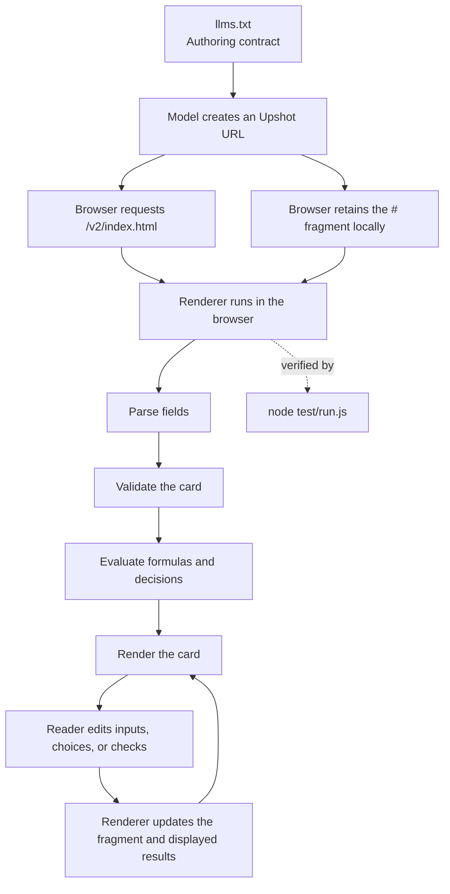

# How Upshot works

Upshot is a static renderer for small tools encoded in URL fragments.

## Runtime

1. `llms.txt` tells a model how to construct a card URL.
2. The model returns a URL. Upshot does not call the model.
3. The web server returns the static file at `v2/index.html`.
4. The browser does not send the URL fragment after `#` to the server.
5. JavaScript in `v2/index.html` parses the fragment, validates its fields,
   evaluates formulas, and writes the card into the page.
6. Input, checkbox, and choice changes are written back into the fragment.
   Results and decisions are recalculated from that fragment.

There is no application server, database, account system, build step, or
runtime dependency. Anyone with the URL can read the card. Card contents may
also exist in browser history, chat history, logs owned by the sender or
recipient, and any service through which the URL is shared.

## Files and responsibilities

| File | Responsibility |
|---|---|
| `index.html` | Landing page and static copy of the current authoring contract |
| `llms.txt` | Current model-facing authoring contract |
| `v2/index.html` | Parser, validator, evaluator, renderer, and interaction state |
| `v1/index.html` | Frozen previous renderer |
| `broken/index.html` | Response for a fragment with no renderable card |
| `made/index.html` | Curated static examples |
| `scripts/sync-prompt.js` | Copies `llms.txt` into the landing page |
| `test/run.js` | Single automated test runner and Chrome harness |
| `test/transport.js` | Transport, encoding, arithmetic, and generated-link scorer helpers |
| `test/boundaries.js` | Boundary fixtures and browser assertions |
| `LANGUAGE.md` | Language rules, maintenance process, known bugs, and known limits |

## Renderer and tests

The production renderer is the JavaScript in `v2/index.html`.

`node test/run.js` is the only automated test command. It loads the production
renderer in Chrome. Its transport helper also extracts the parser and evaluator
from the same file for deterministic encoding and arithmetic checks. The test
code does not serve or power live cards.

## Versioning

The URL path selects the language version. A change that makes a previously
valid card parse, calculate, or render differently requires a new path such as
`/v3/`. Existing versioned renderers remain available for existing links.
