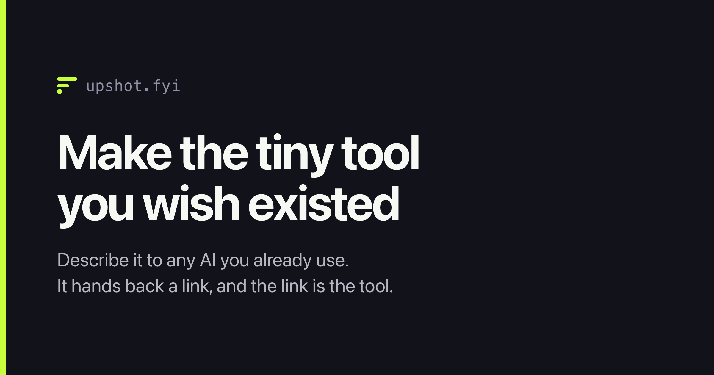
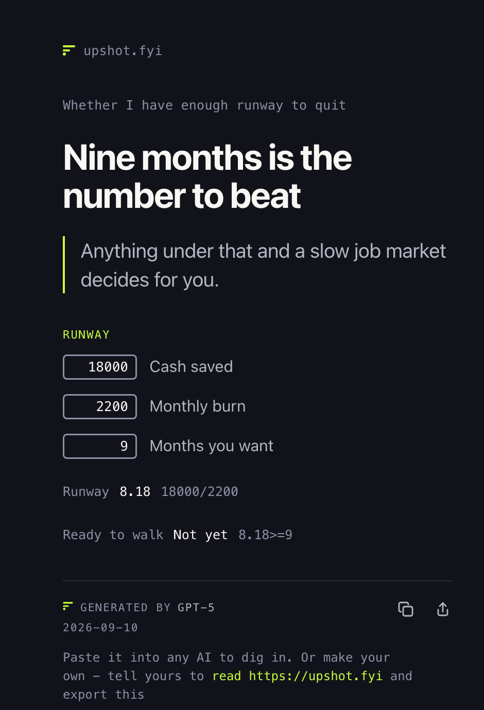

<div align="center">



[](LICENSE)


[](https://upshot.fyi)

</div>

---

Drive or take the train. Whether the annual gym membership is worth it. What
you actually take home after the student loan. Small, specific questions that
nothing exists for and that aren't worth a spreadsheet.

Describe one to an AI and say **"read https://upshot.fyi and export this"**. It
hands back a link, and the link *is* the tool — boxes to type in, formulas that
work themselves out, a verdict that changes its mind when you change the
numbers.

The whole thing lives in the URL, so there is no account, nothing installed and
nothing stored anywhere. Keep it to yourself or send it to someone; it works the
same either way.

## See one

Question, verdict, boxes, formula and decision — all of it encoded in the URL,
and nothing else anywhere:

<div align="center">
  =9 shown beside it.">
</div>

These ones are live. Open them, type in the boxes, watch the numbers move:

- **[Splitting dinner three ways][dinner]** — the whole card is 180 characters
  of URL.
- **[Do I have enough runway to quit?][runway]** — change a number and the
  verdict at the bottom changes its mind.
- **[UK take-home pay, with student loan plans][payslip]** — tick a plan, and
  the tick is written back into your copy of the link.

More at [upshot.fyi/made](https://upshot.fyi/made/).

## The trick

The whole card lives in the URL, after the `#`.

```
https://upshot.fyi/v2/#a=...&h=...&m=GPT-5&d=2026-09-10&g=Split+it&i=Bill:80:bill&i=People:3:n&r=Each+pays:bill/n
```

Browsers never send the part after `#` to a server. So:

- **Nothing is stored, because there is nothing to store.** No database, no
  account, no rows with your text in them. The site cannot see your card even in
  principle.
- **Your numbers never leave your device.** They are worked out in the browser
  and written back into your own copy of the link — an instrument that
  structurally cannot phone home.
- **One static file renders unlimited cards, for free.** There is no per-link
  cost, so there is no reason to ever charge for one.

The flip side, stated plainly: anyone holding the link can read the card, and so
can your chat history. Private from us is not private in general.

## Using it

Say this to any AI that can read a web page:

> read https://upshot.fyi and export this

That's the whole setup. Nothing to paste, no custom GPT, no saved prompt to go
stale. The AI fetches [`/llms.txt`](https://upshot.fyi/llms.txt), learns the
format, and writes the URL.

The verb matters, oddly. "Export this **to** upshot.fyi" reads to a model as a
request to submit your content to a website, which it will often refuse. Asking
it to **read** the domain works. So does including the scheme — `read
https://upshot.fyi` beats `read upshot.fyi`, which a model has to recognise as
a URL before it can fetch one, and sometimes searches for instead.

## The format

A fixed frame with up to three blocks stacked in the middle. The frame is always
the same shape, whatever the card is about: a scope line, a headline, a
one-sentence verdict, the blocks, and a signature saying which model wrote it and
when.

`g=` starts a block and labels it. Nothing else starts one, so a block holds
whatever mix of lines it needs:

| key | what it is |
|---|---|
| `p` | a bullet |
| `o` | a numbered step, where order is the point |
| `c` | a checklist item you can tick off |
| `f` | a `Label:Value` row |
| `i` | a box you type a number into |
| `r` | a `Label:Formula` result, worked out and shown with its working |
| `t` | a `Label:Condition:When+true:When+false` decision |

The AI writes the formulas; you type the numbers. A `t=` handles a decision the
same way — the condition and both outcomes are written in, and whichever one
your numbers make true is the one that shows.

Ticks and typed numbers are written back into the URL as you go, so the link in
your address bar is always a link to the state you're looking at. Bookmark it,
or send that.

Three blocks is the cap. Not a technical limit — a card that needs four blocks is
two cards.

The full spec, with worked examples, is at
[upshot.fyi/llms.txt](https://upshot.fyi/llms.txt). It is written for a model to
read, which makes it a decent short read for a human too.

## Your links keep working

The path is the version. `/v2/` will render every link ever written against it,
permanently. A format change that would alter how an existing card renders gets a
new path — `/v3/` — rather than an edit. `/v1/` is frozen and still works.

That is the entire cost of the promise: an old static file nobody touches again.

## The link has to survive intact

Because the card *is* the link, anything that damages the link destroys the
card — and the damage is usually invisible, since a truncated URL still renders
a perfectly convincing card with half the content missing. All of these were
found by sending real links and looking at what came out the other side:

- **A raw comma or full stop inside a value** stops WhatsApp turning the text
  into a link, and the rest arrives as plain text. It doesn't cut at the
  punctuation — it cuts earlier, so it looks random until you bisect it.
- **A closing bracket that ends a nested pair** does the same. Invisible until
  formulas went into URLs, because prose almost never nests brackets.
- **A pair of `*` or `_`** is eaten as bold or italic before the link is ever
  clicked, so `j*45` silently arrives as `j45` — a different formula.

The fix is one rule rather than a list of characters to remember: in wording keep
letters, digits and a hyphen, in a formula also `+ - / = _`, and percent-encode
everything else. A character nobody has thought of yet is encoded by default.
That matters more than it sounds — the earlier version was a list, and the list
was the bug.

`test/transport.js` models this channel: it round-trips every character through
every field, simulates a markdown-rendering chat client, and checks the shipped
examples still survive both.

## Running it

```
python3 -m http.server 8787
```

Then open `http://localhost:8787/`. There is no build step and no dependencies —
it is static HTML all the way down.

## Tests

```
node test/run.js        # the renderer. Drives whatever Chrome is installed
node test/transport.js  # the URL itself. No Chrome, no model, no network
```

Both are dependency-free. `run.js` asks whether the card draws what the URL says.
`transport.js` asks the question underneath: whether the URL can survive being
sent at all — 900+ character-by-field round trips, the shipped examples through a
simulated chat client, and 4000 generated formulas checked against plain
JavaScript arithmetic.

It also scores a batch of real generations:

```
node test/transport.js links.txt   # one URL per line
```

which reports valid-first-render plus a tally of what went wrong. Links are
scored as text, exactly as they left the model — opening one in a browser proves
nothing, because the address bar never truncates and never renders markdown.

## Writing another renderer

The format is documented for reimplementation, not just for use. `/llms.txt` is
the whole specification, `test/transport.js` contains the encoder as executable
code, and the tests are the closest thing to a conformance suite. If you write a
renderer, links written for `/v2/` should render identically on it.

## Files

| | |
|---|---|
| `index.html` | landing page and spec. Static, plus a head redirect for unversioned `#links` |
| `v2/index.html` | the card: parser, renderer, and nothing else |
| `v1/index.html` | the previous format, frozen |
| `broken/index.html` | the page a link with nothing renderable in it gets |
| `llms.txt` | the format, for AIs that look there |
| `made/` | a hand-curated gallery of cards people have made |
| `test/` | the two suites |
| `VISION.md` | product direction, decisions, what was refused, and why |

## Licence

MIT — see [LICENSE](LICENSE).

Cards themselves are not covered by it: a card lives entirely in its own URL and
never touches this repository. Anyone can put any text in a link, so text on the
domain is not published or endorsed by us, and never reaches us to moderate or
remove.

[dinner]: https://upshot.fyi/v2/#a=Splitting+dinner+three+ways&h=About+twenty+seven+each&v=Service+is+already+in+the+total%2C+so+there+is+nothing+more+to+add%2E&m=GPT-5&d=2026-09-10&g=Split+it&i=Bill:80:bill&i=People:3:n&r=Each+pays:bill/n
[runway]: https://upshot.fyi/v2/#a=Whether+I+have+enough+runway+to+quit&h=Nine+months+is+the+number+to+beat&v=Anything+under+that+and+a+slow+job+market+decides+for+you%2E&m=GPT-5&d=2026-09-10&g=Runway&i=Cash+saved:18000:cash&i=Monthly+burn:2200:burn&i=Months+you+want:9:target&r=Runway:cash/burn:months&t=Ready+to+walk:months%3E=target:Go+now:Not+yet
[payslip]: https://upshot.fyi/v2/#a=UK+take-home+pay+calculator+with+student+loan&h=Calculate+your+2026%2F27+take-home+pay&v=Enter+salary%2C+tick+one+student+loan+plan%2C+and+optionally+Postgraduate+Loan%2E&m=GPT-5%2E6+Sol&d=2026-09-11&g=Pay&i=Annual+salary:40000:salary&r=Personal+allowance:max%280%2C12570-max%280%2Csalary-100000%29%2F2%29:allowance&r=Taxable+income:max%280%2Csalary-allowance%29:taxable&r=Income+tax:min%28taxable%2C37700%29%2A0%2E2%2Bmax%280%2Cmin%28taxable-37700%2C87440%29%29%2A0%2E4%2Bmax%280%2Ctaxable-125140%29%2A0%2E45:tax&r=National+Insurance:min%28max%280%2Csalary-12570%29%2C37700%29%2A0%2E08%2Bmax%280%2Csalary-50270%29%2A0%2E02:ni&g=Student+loan&c=Plan+1+%28tick+one+plan%29:p1&c=Plan+2:p2&c=Plan+4:p4&c=Plan+5:p5&c=Postgraduate+Loan:pg&r=Student+loan:p1%2Amax%280%2Csalary-26900%29%2A0%2E09%2Bp2%2Amax%280%2Csalary-29385%29%2A0%2E09%2Bp4%2Amax%280%2Csalary-33795%29%2A0%2E09%2Bp5%2Amax%280%2Csalary-25000%29%2A0%2E09%2Bpg%2Amax%280%2Csalary-21000%29%2A0%2E06:loan&g=Take+home&r=Annual+take-home:salary-tax-ni-loan:net&r=Monthly+take-home:net%2F12
